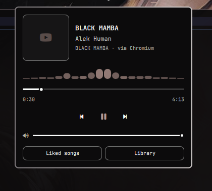

# Omamusic



Bar widget + popup panel for **YouTube Music** via MPRIS
(`Quickshell.Services.Mpris`), for the Omarchy bar.

No background service, no API keys, no persisted state — everything is read
live from the player's D-Bus interface. Click the icon in the bar to open a
popup with album art, track info, a seekable progress bar, shuffle/repeat,
playback controls, volume and a live spectrum histogram.

The plugin is **source-independent**: it never launches or requires any
particular app. Whatever is playing YouTube Music — a native client or a
browser tab — is what it controls.

Inspired by [omaspotify](https://github.com/cempack/omaspotify), rewritten for
YouTube Music.

## Requirements

- **Omarchy** (Quickshell-based desktop)
- A Nerd Font v3 (the icons use the Material Design range)
- A YouTube Music source that speaks MPRIS — either a native client or a
  browser tab, see below
- *Optional:* [`cava`](https://github.com/karlstav/cava) for the spectrum
  histogram. Without it the visualizer simply does not appear.

## Which players work

**Native clients** are matched by MPRIS identity / desktop entry and always
win over browsers:

- [pear-desktop](https://github.com/pear-devs/pear-desktop) — formerly
  `th-ch/youtube-music`; both the old and new identities are matched
- [YTMDesktop](https://github.com/ytmdesktop/ytmdesktop)

Any other client can be added through the `extraPlayerNames` setting.

**Browser playback** on `music.youtube.com` (a normal tab or an installed PWA)
also works through the browser's own MPRIS session — Firefox, Chromium,
Chrome, Brave, Vivaldi, Edge, Opera, Zen, LibreWolf and friends.

There is a catch worth knowing: a browser exposes **one** MPRIS session for
whatever media is currently active, and the metadata contains no URL. So the
widget cannot truly know that the session is YouTube Music. It uses a
heuristic — YouTube Music fills both **artist** and **album**, while plain
YouTube videos leave album empty — which is what *Strict browser match*
(on by default) enforces. It is a good signal, not a guarantee: another site
that reports a full artist/album pair can be picked up too.

If you only ever use a native client, turn **Browser fallback** off and the
guessing stops entirely.

When a browser session is being controlled, the panel shows `via <browser>`
under the track so it is never ambiguous which session you are driving.

## Install

```bash
omarchy plugin add https://github.com/haripako/omamusic.git
```

The plugin is **disabled by default** so you can read the code first:

```bash
omarchy plugin enable io.github.haripako.omamusic
```

Then add it to the bar — you'll be asked where to place it:

```bash
omarchy bar plugin add io.github.haripako.omamusic
```

You can drag-and-drop it to reposition later, or edit
`~/.config/omarchy/shell.json` by hand.

## Usage

- **Left click** — open/close the popup
- **Middle click** — play/pause without opening the popup
- **Scroll over the icon** — volume (when the player supports it)
- **In the popup** — shuffle, previous, play/pause, next, repeat; drag the
  progress bar to seek, drag the volume slider to set volume
- **Music videos** — when the artwork is 16:9 rather than square, the cover is
  drawn as a video thumbnail with a small camera badge
- **Spectrum histogram** — animates while playing, hidden when paused

## Keyboard shortcuts

Inside the popup:

| Key | Action |
|-----|--------|
| `Space` / `Enter` | Play / Pause |
| `n` / `Right` | Next track |
| `p` / `Left` | Previous track |
| `Up` / `Down` | Volume up / down |
| `s` | Toggle shuffle |
| `r` | Cycle repeat (off → playlist → track) |
| `Escape` | Close popup |
| `Tab` | Switch to adjacent panel |

Suggested global keybinding (`~/.config/hypr/bindings.lua`):

```lua
o.bind("SUPER + M", "Toggle Omamusic", "omarchy-shell io.github.haripako.omamusic toggle")
```

## Settings

Configurable from the widget's settings in Omarchy, or directly in the
widget's entry in `~/.config/omarchy/shell.json`:

| Setting | Default | What it does |
|---------|---------|--------------|
| `browserFallback` | `true` | Control music.youtube.com playing in a browser |
| `strictBrowserMatch` | `true` | Only adopt a browser session reporting artist **and** album |
| `extraPlayerNames` | `""` | Comma-separated MPRIS identities/desktop entries to also treat as YouTube Music |
| `showVolume` | `true` | Show the volume slider when supported |
| `scrollVolume` | `true` | Scroll over the bar icon to change volume |
| `showVisualizer` | `true` | Draw the live spectrum histogram while playing |

## Notes and limitations

- **Seeking** requires the player to support it. Native clients do; browsers
  usually report position but not always seek — the progress bar dims when
  seeking is unavailable.
- **Volume** only appears when the player exposes MPRIS volume. Browsers
  generally do not, native clients do.
- **Shuffle / repeat** buttons only appear when the player advertises support,
  so browser sessions typically show neither.
- **Likes / thumbs up** are not exposed over MPRIS and are therefore not
  available here.
- **The visualizer shows system audio, not the player.** `cava` reads the
  default sink monitor, and Linux gives no per-application spectrum without
  capturing that stream directly. If something else is making noise, you will
  see it. cava only runs while the popup is open and playback is active.
- **Video detection is inferred from the artwork ratio** (16:9 vs square), not
  from a metadata flag — MPRIS has none. It is right for the usual cases and
  can be fooled by unusual artwork.

## Update

```bash
omarchy plugin update io.github.haripako.omamusic
```

## Uninstall

```bash
omarchy plugin disable io.github.haripako.omamusic
omarchy plugin remove io.github.haripako.omamusic
```

Then remove the entry from `~/.config/omarchy/shell.json`.

## License

MIT — see [LICENSE](LICENSE).
